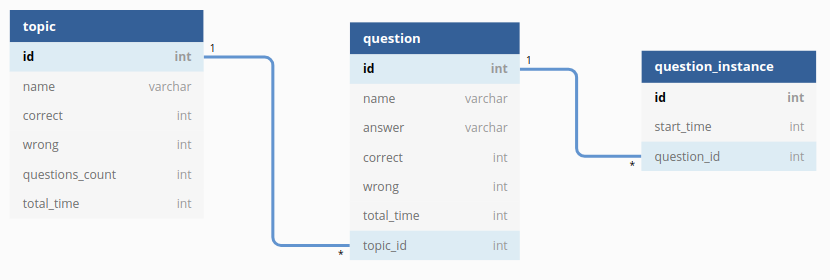
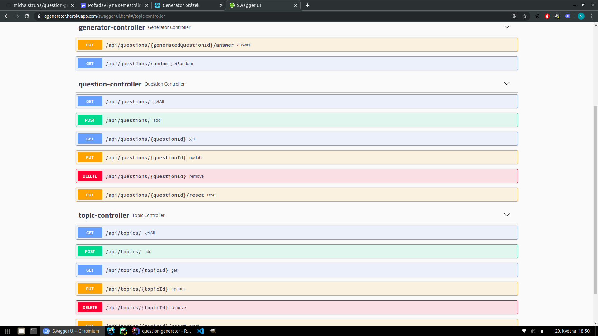
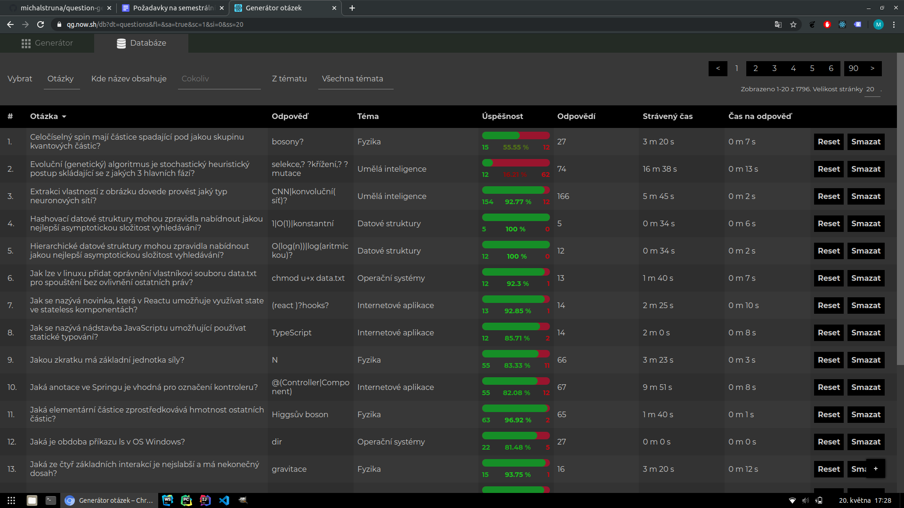

# Generátor otázek

Tento repozitář obsahuje zdrojové kódy pro server a webovou aplikaci umožňující náhodné generování otázek z databáze. Aplikace je vytvořena pro potřebu autora za účelem procvičování si různých teoretických oblastí. Funkcionalita aplikace umožňuje:

* Vytvářet témata a v rámci nich otázky se správnými odpověďmi,
* Generovat náhodné otázky z vybraných témat s možností na ně odpovídat,
* Zaznamenávat statistiky u jednotlivých otázek i souhrnně u témat,
  * Počet správných a špatných odpovědí (+ úspěšnost odpovídání),
  * Celkem strávený čas,
  * Průměrný čas na odpověď,
* Vyhledávat otázky v databázi včetně možnosti je filtrovat dle názvu nebo tématu.

## Frontend
### Technologie a knihovny

* TypeScript
* React
* Redux
* React hooks
* React router
* Styled components
* Axios

### Struktura

Aplikace je členěna do modulů, kde každý modul je adresářem obsahující následující poadresáře:

* **Components**: TSX komponenty,
* **Constants**: konstanty a konfigurace,
* **Hooks**: React hooks,
* **Redux**: Akce, reducer a selektory,
* **Utils**: Pomocné třídy či metody,
* **Views**: TSX komponenty reprezentující celou stránku.

Tento přístup je výhodný především u větších aplikací, nicméně těm menším poskytuje flexibilitu pro případné rozšíření do budoucna. Navíc umožňuje z modulu importovat více položek najednou, což je nejen kratší, ale také přehlednější:

```tsx
import { Link, Url, Query } from './Routing'
import { Color, Dimension, Keyframe } from './Style'
```

Na frontendu byly vytvořeny tyto moduly:

* **Async**: Asynchronní operace, HTTP požadavky a loader,
* **Core**: Základní části aplikace jako je App.tsx, globální styly nebo redux store,
* **Data**: Práce s daty, stránkování, řazení a lokalizace,
* **Form**: Práce s formuláři,
* **Generator**: Implementace samotného generátoru otázek,
* **Layout**: Univerzální komponenty jako např. tabulka, tlačítko nebo nadpisy,
* **Native**: Práce s nativními funkcemi prohlížeče (events, cookies, pole, datum, ...),
* **Routing**: Práce s odkazy mezi stránkami a query parametry,
* **Style**: Barvy, dimenze, animace a další pomocné struktury pro stylování.

## Backend

### Databáze

Pro perzistentní ukládání dat byla zvolena databáze H2. Některé informace, které by byli výsledkem agregačních dotazů (např. počet otázek v tématu) jsou cachovány přímo v databázi.



### REST API

Server vystavuje REST API a graficky ho dokumentuje pomocí Swagger UI. Ten je možné nalézt na adrese [qgenerator.herokuapp.com/swagger-ui.html](https://qgenerator.herokuapp.com/swagger-ui.html).



## Výsledek

Aplikace je dostupná na adrese [qg.now.sh](https://qg.now.sh).

